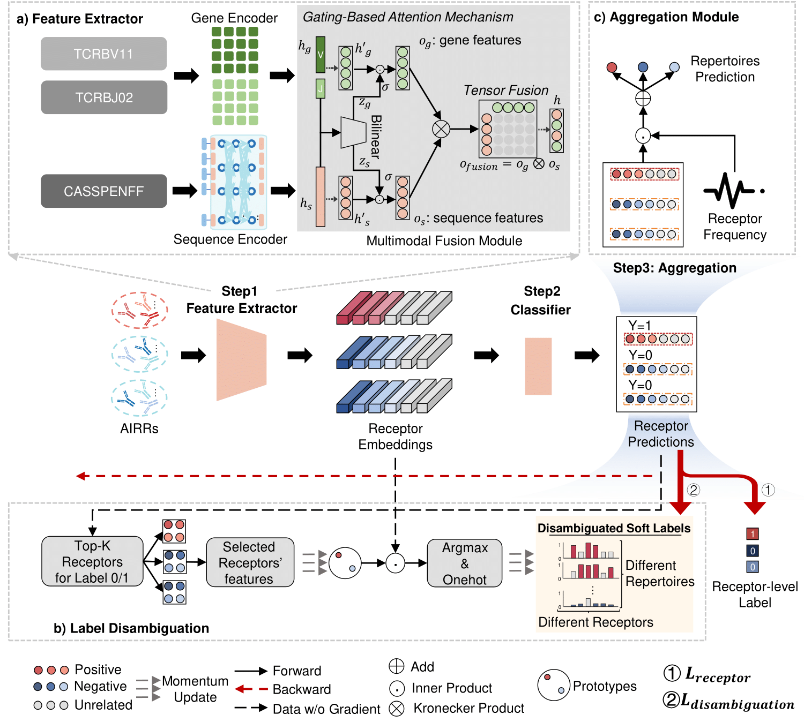

# LaDM<sup>3</sup>IL

[](https://www.python.org/) 

### A label disambiguation-based multimodal massive multiple instance learning approach for immune repertoire classification
One individual human’s immune repertoire consists of a huge set of adaptive immune receptors at a certain time point, representing the individual's adaptive immune state. Immune repertoire classification and associated receptor identification have the potential to make a transformative contribution to the development of novel vaccines and therapies. The vast number of instances  (10<sup>7</sup>-10<sup>8</sup>) and exceedingly low witness rate pose a great challenge to the immune repertoire classification, which can be formulated as a Massive Multiple Instance Learning (MMIL) problem. Traditional MIL methods, at both bag-level and instance-level, confront the issues of substantial computational burden or supervision ambiguity when handling massive instances. To address these issues, we propose a novel label disambiguation-based multimodal massive multiple instance learning approach (LaDM<sup>3</sup>IL) for immune repertoire classification. LaDM<sup>3</sup>IL adapts the instance-level MIL paradigm to deal with the computation capacity issue and employs a specially-designed label disambiguation module for label correction, mitigating the impact of misleading supervision. To achieve a more comprehensive representation of each receptor, LaDM<sup>3</sup>IL leverages a multimodal fusion module with gating-based attention and tensor-fusion to integrate the information from gene segments and amino acid (AA) sequences of each immune receptor. Extensive experiments on the Cytomegalovirus (CMV) and Cancer datasets demonstrate the superior performance of the proposed LaDM<sup>3</sup>IL for both immune repertoire classification and associated receptor identification tasks.


<center>The overall framework of LaDM<sup>3</sup>IL, which consists of a feature extractor, a label disambiguation module and an aggregation module. a) Feature Extractor: Using the receptor CASSPENFF, in conjunction with the V gene (TCRBV11) and J gene (TCRBJ02), as an illustrative example. A pre-trained model SC-AIR-BERT (Zhao, Yu, et al.) works as the sequence encoder to embed the sequence and a trainable embedding layer works as a gene encoder to embed the V(D)J gene segments. Gating-based attention mechanism and a tensor fusion module are applied to integrate the learnt gene and AA sequence features. b) Label Disambiguation (To facilitate a clearer understanding of the core concept, we present the binary classification scenario as an exemplar in this figure, as it offers a more straightforward illustration.): The prototype is generated to represent the feature embedding of each class. During the training process, the top-K receptors will be selected to update the embedding of the corresponding class in the prototype and the label of each receptor will be adjusted according to the similarity between the receptors' feature embedding and prototypes' feature embedding. c) Aggregation Module: After obtaining the prediction of each receptor from the classifier (multilayer perception), the aggregating module integrates these predictions by multiplying them with their corresponding frequencies and subsequently normalizing the results to generate the repertoire-level prediction. </center>

# System requirements
## Hardware requirements
LaDM<sup>3</sup>IL package requires only a standard computer with enough RAM and a NVIDIA GPU to support operations.
## Software requirements
### OS requirements
This tool is supported for Linux. The tool has been tested on the following systems: <br>
+ CentOS Linux release 8.2.2.2004
+ Ubuntu 18.04.5 LTS
### Python dependencies
LaDM<sup>3</sup>IL mainly depends on the Python scientific stack.   <br>

+ The important packages including:
```
    numpy               1.26.0
    pandas              2.1.2
    torch               1.12.1
    torch_geometric     2.4.0
    transformers        4.28.1
    scikit-learn        1.0.2
    scipy               1.11.3
```
+ `./LaDM3IL/requirement.yaml` describes more details of the requirements.    
### Pretrained model Requirements
Download `SC-AIR-BERT` model

`SC-AIR-BERT` is a pre-trained model that learns comprehensive sequence representations, which is avaiable from [https://github.com/TencentAILabHealthcare/SC-AIR-BERT]
    
    The downloaded model should be stored as:
    ./LaDM3IL/pretrained  \
        ab_3mer_len79.ep28
        vocab_3mer.pkl

# Install guide
## For conda users

### 1-Configure the enviroment.
```
git clone https://github.com/TencentAILabHealthcare/LaDM3IL.git 
cd ./LaDM3IL
conda create -n ladmil python=3.9
conda activate ladmil
pip install numpy==1.26.0 pandas==2.1.2 transformers==4.28.1 scikit-learn==1.0.2 scipy==1.11.3 nni==1.9 matplotlib tensorboard
conda install pytorch==1.12.1 torchvision==0.13.1 torchaudio==0.12.1 cudatoolkit=11.3 -c pytorch
conda install pyg -c pyg
conda install cuda -c nvidia
conda deactivate
```

### 2-Inference.

(1) CMV

```csharp
cd training_cmv/classification

python train_multimodal.py \
--batch_size 128 \
--updprot_threshold 0.8 \
--prot_start 15 \
--proto_ema 0.810 \
--vocab_path ../../pretrained/vocab_3mer.pkl \
--gene_token ../../dataset/cmv/train_val_test/gene.csv \
--train_dataset ../../dataset/cmv/train_val_test/train.tsv \
--valid_dataset ../../dataset/cmv/train_val_test/val.tsv \
--test_dataset ../../dataset/cmv/train_val_test/test.tsv \
--output_path ../../result/cmv \
--reuse_ckpt_dir ../../pretrained/cmv_classification/max_auc_model.pth
```

(2) Cancer

```csharp
cd training_deepcat/classification

python train_seqonly.py \
--batch_size 16 \
--updprot_threshold 0.9 \
--prot_start 15 \
--proto_ema 0.963 \
--train_dataset ../../dataset/deepcat/train_val_test/train.tsv \
--valid_dataset ../../dataset/deepcat/train_val_test/val.tsv \
--test_dataset ../../dataset/deepcat/train_val_test/test.tsv \
--output_path ../../result/deepcat \
--reuse_ckpt_dir ../../pretrained/deepcat_classification/max_auc_model.pth
```

# Dataset:

Data are given in `./dataset`.

# Disclaimer
This tool is for research purpose and not approved for clinical use.

This is not an official Tencent product.

